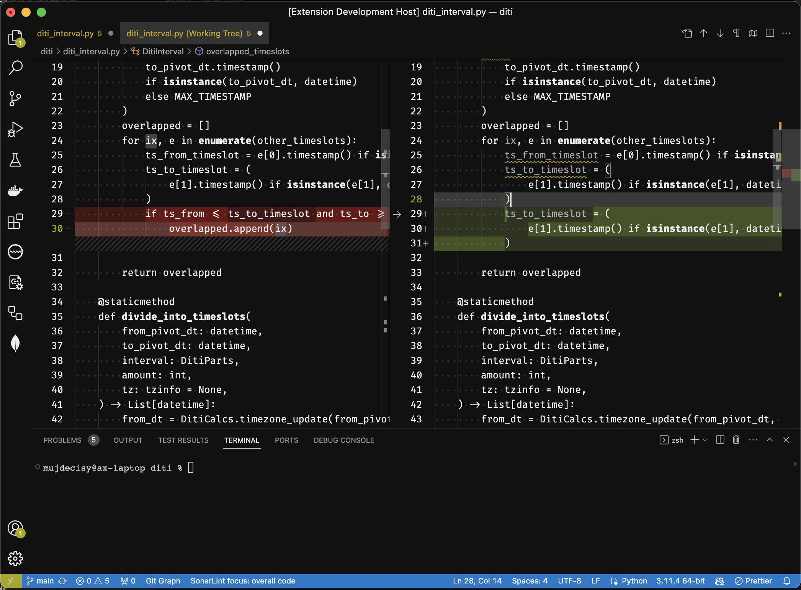

# Simple BW Theme

The **Simple BW Theme** is a visually captivating theme designed specifically for the popular code editor, Visual Studio Code (VSCode). As the name suggests, this theme adopts a simplistic yet powerful approach by utilizing a **black and white color palette** throughout.

The primary goal of the Simple BW Theme is to provide users with an aesthetic experience that is both **subtle and elegant**. By employing smooth transitions between shades of black and white, this theme creates a **calming and soothing atmosphere** for developers and programmers.

One notable advantage of the Simple BW Theme is its ability to alleviate eye strain and fatigue. The absence of vibrant and contrasting colors helps prevent excessive eye stimulation, allowing coders to work for extended periods without experiencing visual discomfort. The deliberate choice of black and white tones promotes a **relaxed and focused mindset**, fostering increased productivity and concentration.

It is important to note that the Simple BW Theme does not include **syntax highlighting**. This intentional omission aligns with the theme's overarching philosophy of simplicity and minimalism. By eliminating syntax highlighting, the theme encourages users to focus more on the structure and logic of their code rather than relying on visual cues provided by color variations.

To get a visual impression of the Simple BW Theme, please refer to the photos showcased below. These images will provide a glimpse into the seamless integration of smooth black and white elements, offering a glimpse of the aesthetic appeal and overall experience that this theme brings to the coding environment.

